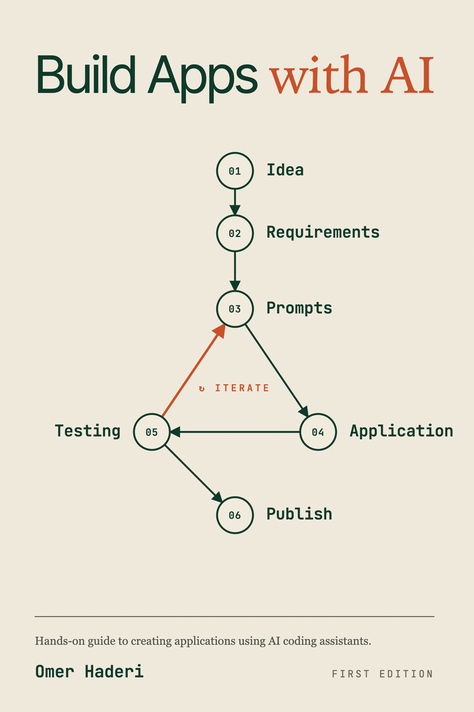

<p align="center">
  
</p>

This is the companion repository for *Build Apps with AI: Hands-on guide to creating applications using AI coding assistants*.

If you're reading the book, this repo will help you with the following:

- **Copy-paste prompts**: every purple prompt box from the book, organized by chapter, ready to paste straight into Claude Code
- **Errata and updates**: when something in the book becomes outdated (a Firebase console redesign, a new Expo SDK, a deprecated package), the fix lands here first
- **Help when you're stuck**: open an Issue describing what's not working; the community and the author monitor them
- **Talk to other readers**: share progress, swap solutions, post your finished app in Discussions

> If you hit a wall at 11 PM and the book doesn't cover your specific error, the Issues tab is the fastest path to an answer. Bookmark this page.

---

## How this repo is organized

```
.
├── prompts/                    Copy-paste prompts from every chapter
│   ├── README.md               Index of all prompts
│   ├── chapter-04/             One folder per chapter
│   ├── chapter-05/
│   └── ...
├── errata.md                   Known issues and corrections to the book
├── changelog.md                What's changed in each book revision
└── README.md                   This file
```

Each chapter folder contains one `.md` file per prompt, in the order they appear in the book. Filename pattern: `NN-short-description.md`.

For example, Chapter 5 (Building the Today Screen) contains the prompt that builds the entire main screen with habit cards, the prompt that fixes the safe-area status-bar overlap, and the prompt that updates `CLAUDE.md` at the end.

---

## How to use the prompts

1. Open the chapter folder for the chapter you're on
2. Find the prompt for the step you're at
3. Click the file → click the "Copy raw file" icon (top right)
4. Paste into Claude Code

The prompts work as-is with **Claude Code**. They are also compatible with **OpenAI Codex CLI** the format is the same. If you use a different AI coding assistant the prompts should work but you may need to adapt platform-specific wording (e.g., "select Yes and press Enter" assumes Claude Code's permission UX).

You are welcome to modify these prompts for your own projects. They are released under the MIT License (see `LICENSE`).

---

## When something is wrong

### The book says do X, but Y happened

Check `errata.md` first. If it's not listed there, **open a new issue**:

1. Click the **Issues** tab above
2. Click **New issue**
3. Use the template, it asks for chapter number, step number, what you expected, what happened, and the full error message
4. Submit

If many readers report the same issue, the fix gets added to `errata.md` and reflected in the next book revision.

### You're stuck but the book *does* cover your situation

Re-read **Chapter 21: Troubleshooting Common Issues**, especially the **Escalation Ladder** at the end. Most stuck-points have a corresponding entry there.

If you've climbed the ladder and you're still stuck, open an issue with the `help-wanted` label.

---

## Discussions

The [Discussions tab](../../discussions) is for:

- **Sharing your app**: finished HabitFlow? Built something else with what you learned? Post a screenshot, a link to your app store listing, or a video
- **Asking general questions**: "Should I add a paid tier?" "Which icon design feels more trustworthy?", things that aren't bugs but where you want a second opinion
- **Trading techniques**: readers often discover better prompts or shortcuts than the book uses. Share them here
- **App ideas**: bouncing concepts off other builders before committing weeks to a project

---

## Get the book

*Build Apps with AI* is available in:

- **Paperback**: Amazon (recommended for desk-reference reading while you build)
- **Kindle**: Amazon (read on phone, e-reader, or tablet)
- **PDF**: Gumroad (best for following along on a second monitor)
- **EPUB**: Apple Books, Kobo

A copy of the book makes this repo much more useful, but the prompts are free for anyone who finds them.

---

## License

- **Prompts and code samples:** MIT License, use freely in your own projects, commercial or not
- **Book content:** © 2026 Omer Haderi. All rights reserved. Don't redistribute the book text itself.

---

## A note from the author

This is your safety net. If you're following the book and something doesn't work, **it is almost never your fault**. Software changes, libraries get updated, Apple redesigns App Store Connect every six months. When you find something broken, please report it — you're helping every reader who comes after you.

Now go ship something.

— Omer
